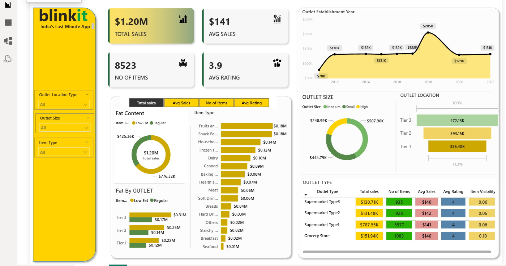

# 🛒 Blinkit Sales Analysis Dashboard  
*A Power BI case study exploring retail performance, customer satisfaction, and outlet strategy.*

---

## 🧰 Tech Stack
- Power BI  
- Excel  
- DAX  

---

## 📖 About This Project
This project analyzes sales performance for Blinkit, a leading quick-commerce retailer.  
Using 8,000+ rows of structured retail data, it explores how item type, fat content, outlet size, and location impact revenue and customer satisfaction.

The goal is simple: turn raw data into actionable business intelligence.

---

## 🎯 Business Objectives
This dashboard helps stakeholders answer key business questions:

- 📈 Identify high-performing product categories  
- 🏢 Compare outlet performance by size and location  
- 😊 Track trends in customer ratings  
- 🥑 Evaluate Low Fat vs. Regular item performance  
- 📦 Improve inventory planning and outlet expansion strategies  

---

## 📊 Key KPIs Tracked

| Metric        | Description |
|---------------|-------------|
| **Total Sales** | Total revenue generated across all outlets |
| **Avg. Sales**  | Revenue per item sold |
| **Item Count**  | Total number of items sold |
| **Avg. Rating** | Customer satisfaction score (1–5 scale) |

---

## 🖼️ Dashboard Highlights

### 🥑 Sales by Fat Content
- Compare performance between Low Fat and Regular items.

### 🛒 Top Performing Item Categories
- Identify categories contributing the most to revenue.

### 🏬 Outlet Size Performance
- Compare sales across Small, Medium, and Large outlets.

### 📍 Location Insights
- Analyze revenue performance by city/zone.

---

## 🛠️ Tools & Methods
- Power BI Desktop – Report building and visualization  
- Power Query – ETL, preprocessing, data cleanup  
- DAX – Calculated measures and KPIs  
- Excel – Data preparation and validation  

---

## 🧹 Data Cleaning & Transformation

Key preprocessing steps performed:

- Removed null values and duplicates  
- Standardized category names (e.g., LF → Low Fat)  
- Corrected data types for dates, numbers, and currency  
- Built a relational data model  
- Created calculated columns for margins and rating trends  

---

## 📥 How to Use

1. Download `blinkit_sales_data.xlsx`  
2. Download `Blinkit_Dashboard.pbix`  
3. Open the `.pbix` file in Power BI Desktop  
4. Use slicers to filter by location, outlet type, fat content, etc.  
5. Customize visuals as needed for your own analysis  

---
🤝 Connect

I'm always open to feedback on data visualization & Power BI design!

LinkedIn: https://www.linkedin.com/in/kaveri-koli11/

Email: kolikaveri99@gmail.com

Built with ❤️ using Power BI & DAX.
